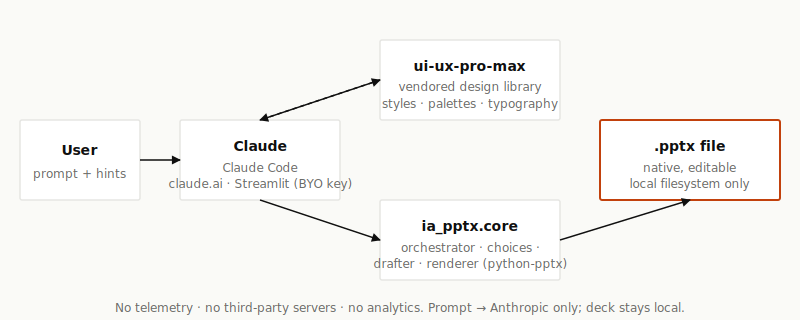

# ia-pptx-generator


**AI-generated PowerPoint decks that don't look AI-generated.**

[](LICENSE) · No signup · No telemetry · Free forever · Built on [`ui-ux-pro-max`](https://github.com/nextlevelbuilder/ui-ux-pro-max-skill)

---

## Install

### Claude Code (one command)

```bash
# (placeholder until skill marketplace publishing — see CONTRIBUTING.md for the manual install path)
git clone https://github.com/USERNAME/ia-pptx-generator
# Then point Claude Code at skills/ia-pptx/ as a local skill.
```

### claude.ai (skills upload)

```bash
# Build the skill bundle
python3 scripts/build_skill_bundle.py
# Upload dist/ia-pptx-skill.zip via claude.ai's Skills panel.
```

### Authenticating (Streamlit only — skill paths inherit Claude's session)

```bash
python3 -m ia_pptx login    # opens Anthropic console, you paste your key
python3 -m ia_pptx status   # show where the key is loaded from
python3 -m ia_pptx logout   # remove the local credentials file
```

Resolution order: **`.env` (repo) → `~/.config/ia-pptx/credentials.json` → `ANTHROPIC_API_KEY` env var**. The login command stores the key with mode `0600` permissions.

### Streamlit (local web app, bring your own key)

<details>
<summary>Detailed walkthrough for non-developers (click to expand)</summary>

This walkthrough assumes no prior Python knowledge. It will get you from a fresh machine to a working local web app.

**1. Install Python 3.11 or newer.** If you don't already have Python, download it from [python.org](https://www.python.org/downloads/) — pick the latest 3.11+ installer for your OS. Python is needed to run Streamlit; this is a one-time install.

**2. Clone the project.** Open a terminal and run:

```bash
git clone https://github.com/USERNAME/ia-pptx-generator
cd ia-pptx-generator
```

**3. Install dependencies.** From the project directory:

```bash
# Recommended — install all optional extras (Streamlit + WeasyPrint renderer):
pip install -e ".[all]"

# Or just the Streamlit surface and the python-pptx renderer:
pip install -e ".[streamlit]"
```

This installs `streamlit`, `python-pptx`, `anthropic`, `weasyprint`, `jinja2`, and a few helpers. It's a one-time step.

**Optional — for the pptxgenjs renderer (richer editable .pptx design):**

```bash
# Install Node.js 20+ from https://nodejs.org if you don't have it.
npm install                # picks up pptxgenjs declared in package.json
```

**Optional — system deps for WeasyPrint (Linux):**

```bash
# Debian/Ubuntu
sudo apt install libpango-1.0-0 libpangoft2-1.0-0
# macOS
brew install pango
```

**4. Get an Anthropic API key.** Sign up at [console.anthropic.com](https://console.anthropic.com/settings/keys), create a key, and copy it (top-right menu → **API Keys** → **Create Key** → copy the `sk-ant-...` value). Usage charges go to your Anthropic account, not to this project.

**5. Save the key locally.** Pick the option that suits you:

```bash
# Option A (recommended) — interactive login.
# Opens the Anthropic console in your browser, you paste the key,
# and it's saved to ~/.config/ia-pptx/credentials.json (mode 0600).
python3 -m ia_pptx login

# Option B — repo-local .env file (good for project-only scoping).
cp .env.example .env
# then edit .env and replace the placeholder ANTHROPIC_API_KEY value.

# Option C — process environment (transient; only this terminal).
export ANTHROPIC_API_KEY="sk-ant-..."             # macOS / Linux
$env:ANTHROPIC_API_KEY = "sk-ant-..."              # Windows PowerShell
set ANTHROPIC_API_KEY=sk-ant-...                   # Windows CMD
```

The Streamlit app and skill scripts resolve the key in this order: **`.env` (repo) → `~/.config/ia-pptx/credentials.json` → `ANTHROPIC_API_KEY` env var**. Use `python3 -m ia_pptx status` to see which sources are present.

**6. Run the app.** From the project directory:

```bash
streamlit run app.py
```

Your browser opens at `http://localhost:8501`. Type a prompt, click **Generate deck**, and download the `.pptx` when it's ready. To stop the server, press `Ctrl+C` in the terminal.

#### Troubleshooting

- **"`streamlit: command not found`"** — Streamlit isn't on your `PATH`. Run `python3 -m streamlit run app.py` instead, or activate the virtual environment first.
- **"`No module named ia_pptx`"** — the editable install didn't complete. From the project directory, re-run `pip install -e ".[streamlit]"` and try again.
- **"No Anthropic API key found" banner stays visible** — none of the three sources is set. Easiest fix: run `python3 -m ia_pptx login` once and paste the key. Verify with `python3 -m ia_pptx status`.
- **"Permission denied" on macOS** — try a virtual environment: `python3 -m venv .venv && source .venv/bin/activate && pip install -e ".[streamlit]"`.
- **Port 8501 already in use** — another Streamlit app is running. Either stop it, or run on a different port: `streamlit run app.py --server.port 8502`.

If something else goes wrong, file an issue with the exact terminal output — the maintainer or another contributor can usually help quickly.

</details>

## How it works

You type what your deck is about. Claude — armed with a vendored copy of [`ui-ux-pro-max`](https://github.com/nextlevelbuilder/ui-ux-pro-max-skill)'s 60+ design styles — commits to a layout grid, section structure, hierarchy, and content density *before* drafting any slide. The renderer emits a native `.pptx` you can open and edit in PowerPoint, Keynote, or Google Slides. No template catalog, no rasterization.



## Example prompts

These five prompts are part of the canonical falsification corpus (see `src/ia_pptx/eval/corpus.yml`). Each produces a structurally distinct deck:

| Use case | Prompt |
|---|---|
| Student exposé | *"An exposé about the French Revolution for a high-school history class, ~12 slides."* |
| Professional pitch | *"A 15-minute pitch deck for a B2B SaaS product launching in Q3, audience is procurement leaders."* |
| Research summary | *"A 10-slide summary of a recent paper on retrieval-augmented generation for a journal club."* |
| Project update | *"A 6-slide project status update for a quarterly leadership review — no fluff."* |
| Conference talk | *"A 20-minute conference talk on humane software design, audience is design-leaning engineers."* |

Run the corpus yourself:

```bash
python3 -m ia_pptx.eval.falsification
```

Output: 10 decks in `out/falsification/` plus a layout-grid distribution report. The check fails if any single layout grid recurs in more than 3 of 10 decks — the wedge regression test.

## What this is and isn't

**This project does:**

- Generate visually distinctive decks from a prompt across at least 4 layout grids (single-column, two-up, asymmetric, bento) and 60+ styles from the vendored design library.
- Output native, editable `.pptx` (text stays editable in PowerPoint).
- Work in any natural language Claude supports (English, French, Spanish, German, etc.).
- Run on the user's own Claude subscription or Anthropic API key.

**This project does NOT:**

- Edit existing decks (a sibling iteration skill is planned).
- Import brand assets (planned post-MVP).
- Make up real data — AI-generated numbers are plausibly fabricated. Verify or supply your own.
- Send any data anywhere except your prompt to Anthropic. No telemetry. No analytics. No accounts.

## Trust

- **MIT licensed.** See [`LICENSE`](LICENSE) and [`THIRD_PARTY_LICENSES.md`](THIRD_PARTY_LICENSES.md).
- **No signup, no quota.** Cost (if any) is your existing Claude subscription or your own Anthropic API tokens.
- **No telemetry.** The skill makes no network calls beyond what Claude itself performs. The Streamlit app's only network destination is `api.anthropic.com` using your key. Verifiable by source-code inspection.
- **Vendored upstream:** [`ui-ux-pro-max`](https://github.com/nextlevelbuilder/ui-ux-pro-max-skill) (MIT, by nextlevelbuilder).

## Contributing

See [`CONTRIBUTING.md`](CONTRIBUTING.md). New contributors should be able to clone, run tests, and submit a focused PR within an hour. Issues labeled `good-first-issue` are a good entry point.

## License

[MIT](LICENSE).

---

> Built by Florian as a student fed up with classmates' decks all looking the same.
