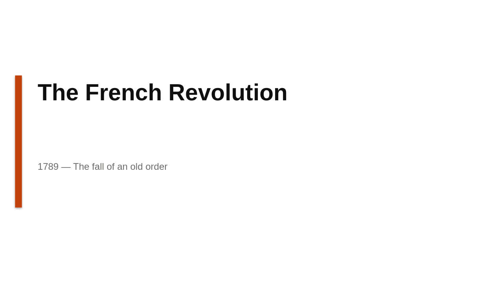
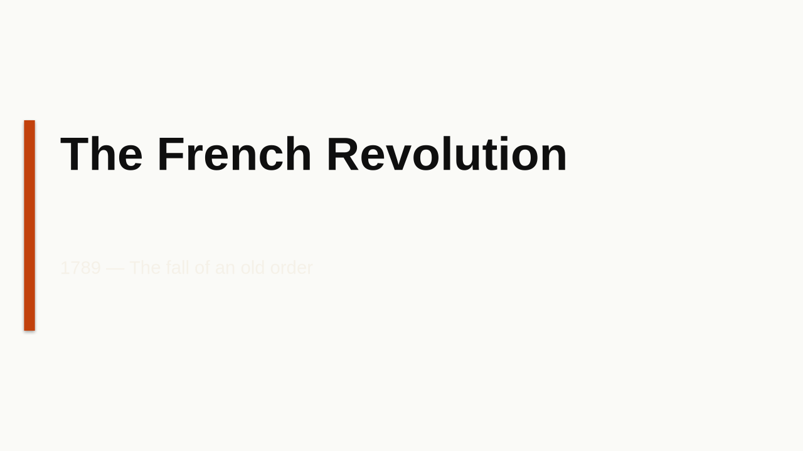
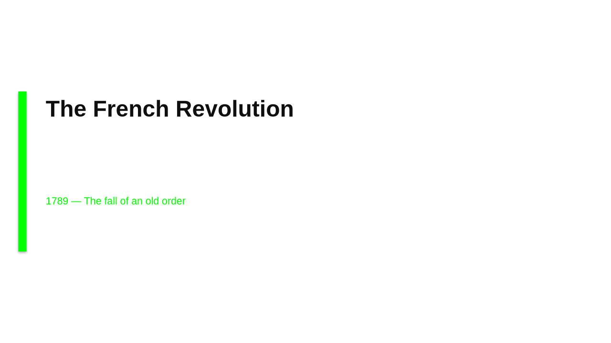

v0.8.0 · Public beta

<h1 class="qp-title">Editorial-grade decks via Claude + visual&nbsp;QA loop.</h1>

Claude writes the deck source code directly — pptxgenjs JS for editable <code>.pptx</code>, HTML + CSS for publication-quality <code>.pdf</code>. A vision pass spots rendering bugs and asks Claude to revise. A 10-atom critique scores typography and information density. <strong>No fixed templates. 67 hand-curated themes.</strong>

<a class="qp-cta" href="https://github.com/Aionmizu/quick-pptx">⭐&nbsp;Star on GitHub</a>
<a class="qp-cta secondary" href="https://github.com/Aionmizu/quick-pptx#install--5-minutes-one-time">Install in 5 min</a>

<h2 class="qp-section">Five themes from the library</h2>

Each generation picks one of 67 themes — palette, typography pairing, composition mood — drawn from the vendored <code>ui-ux-pro-max</code> library. <code>--style auto</code> lets a small LLM call pick the best fit for your prompt.

  <a class="qp-card" href="https://github.com/Aionmizu/quick-pptx#themes">
    
    

      
Theme

      <h3 class="qp-card-title">Editorial Grid Magazine</h3>
    

  </a>
  <a class="qp-card" href="https://github.com/Aionmizu/quick-pptx#themes">
    
    

      
Theme

      <h3 class="qp-card-title">Minimalism Swiss Style</h3>
    

  </a>
  <a class="qp-card" href="https://github.com/Aionmizu/quick-pptx#themes">
    
    

      
Theme

      <h3 class="qp-card-title">Brutalism Asymmetric</h3>
    

  </a>
  <a class="qp-card" href="https://github.com/Aionmizu/quick-pptx#themes">
    
    

      
Theme

      <h3 class="qp-card-title">Bento Box Grid</h3>
    

  </a>
  <a class="qp-card" href="https://github.com/Aionmizu/quick-pptx#themes">
    
    

      
Theme

      <h3 class="qp-card-title">Flat Design</h3>
    

  </a>

<h2 class="qp-section">What's in the box</h2>

  

    <h3>Plan critic</h3>
    
Adversarial pre-flight reviews your prompt — concerns, refined prompt, slide outline, image suggestions. Verdict ship/refine/block.

  

  

    <h3>Visual QA loop</h3>
    
Each slide rendered to JPG, vision pass spots overflow / overlap / contrast / orphan-word bugs. ≤ 3 revise passes.

  

  

    <h3>10-atom critique</h3>
    
Naegle-aware rubric per slide: title-as-conclusion, ≤ 6 elements, focal-visual ≥ 30%, every-word-essential, terse sources.

  

  

    <h3>Nano Banana 2</h3>
    
Optional Gemini image generation — diagrams, hero images, icons. SDK or REST fallback. 14 aspect ratios up to 4K.

  

  

    <h3>Bring your own LLM</h3>
    
Claude Code CLI (subscription) or Anthropic API key. Carte-blanche tools opt-in, narrowed by default.

  

  

    <h3>Zero telemetry</h3>
    
No signup, no tracking, no remote anything. Local credentials at <code>~/.config/ia-pptx</code> mode 0600.

  

<h2 class="qp-section">Quick start</h2>

Five minutes from clone to your first deck. Linux primarily; macOS works; Windows untested.

<pre class="qp-code">git clone https://github.com/Aionmizu/quick-pptx
cd quick-pptx
pip install -e ".[dev]"
npm install
python3 scripts/install_fonts.py    # one-time, ≈ 30 sec

# Either install Claude Code (claude.com/code) — uses your subscription
# Or save an Anthropic API key:
python3 -m ia_pptx login

# Run the Streamlit app
streamlit run app.py</pre>

<footer class="qp-foot">
  
MIT licensed · Built by <a href="https://github.com/Aionmizu">Aionmizu</a> · <a href="https://github.com/Aionmizu/quick-pptx/issues/new/choose">Report a bug</a>

</footer>

