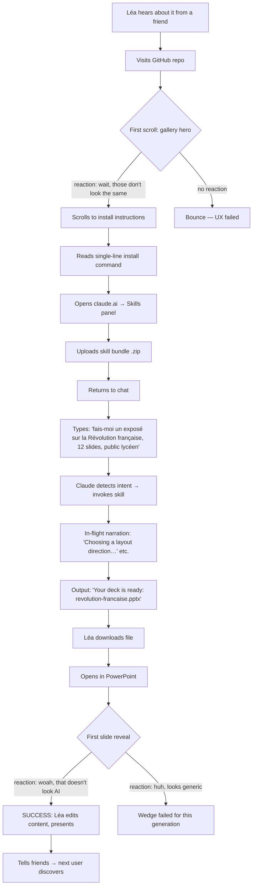
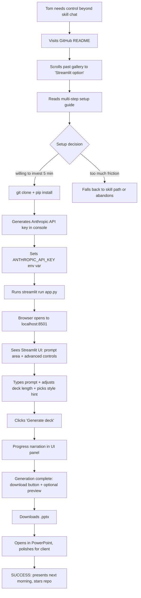

---
stepsCompleted:
  - step-01-init
  - step-02-discovery
  - step-03-core-experience
  - step-04-emotional-response
  - step-05-inspiration
  - step-06-design-system
  - step-07-defining-experience
  - step-08-visual-foundation
  - step-09-design-directions
  - step-10-user-journeys
  - step-11-component-strategy
  - step-12-ux-patterns
  - step-13-responsive-accessibility
  - step-14-complete
status: complete
completedAt: "2026-05-05"
lastStep: 14
inputDocuments:
  - documentations/planning-artifacts/prd.md
  - documentations/planning-artifacts/product-brief-IA-pptx-generator.md
  - documentations/planning-artifacts/product-brief-IA-pptx-generator-distillate.md
userDirectives:
  - "Utilise ui-ux-pro-max skills pour faire une interface intuitive (use ui-ux-pro-max as the design intelligence layer for the UX itself — eat your own dog food)"
documentCounts:
  prd: 1
  brief: 1
  distillate: 1
workflowType: 'ux-design'
---

# UX Design Specification — IA-pptx-generator

> ⚠️ **SUPERSEDED IN PARTS BY THE v0.2 PIVOT.** Streamlit screens that referenced renderer choice (python-pptx / pptxgenjs / WeasyPrint), "I have a plan" mode, key takeaway, audience, style hint chips, forced style picker, language selector, deck length slider, advanced expander, and rasterized preview thumbnails — superseded. v0.2 Streamlit has: prompt textarea, output format (`.pptx` or `.pdf`), slide count, QA passes, optional LLM-backend expander, and inline per-slide JPG preview rendered from the actual output. Loading state copy is now driven by phase strings emitted by the pipeline's progress callback. See [`../PIVOT-2026-05.md`](../PIVOT-2026-05.md).

**Author:** Florian
**Date:** 2026-05-05

---

<!-- UX design content will be appended sequentially through collaborative workflow steps -->

## Executive Summary

### Project Vision

IA-pptx-generator is an open-source Claude project that turns prompts into visually distinctive PowerPoint decks. The UX must mirror the product wedge itself: *not generic.* Every interface surface — Streamlit UI, skill invocation flow, README, gallery, even the generated decks themselves — should feel designed, not templated. The user directive for this UX phase is explicit: **use `ui-ux-pro-max` as the design-intelligence layer for our own UI** — eat the dog food, prove the thesis on the project's own surfaces.

### Target Users

Per the PRD, the v1 design anchor is the **student making an exposé** (Léa archetype): non-technical, time-pressed, wants something that doesn't look AI-generated. They live in claude.ai or visit the GitHub repo from a friend's recommendation. They will *not* read documentation longer than three paragraphs before bouncing. They will judge the project visually within seconds of landing on the README or gallery.

Secondary user shaping v1 only at the edges: the **Streamlit power-user** (Tom archetype) — a non-developer who tolerates a Python install in exchange for advanced controls. The Streamlit surface, if it ships, must feel approachable to a non-developer despite the technical install ceiling.

Out-of-scope-for-MVP-but-design-aware: maintainer (Florian), open-source contributor (Riku), small-business brand-import user.

### Surfaces in scope for UX work

The UX of this project is multi-surface. Each surface has its own design weight:

| Surface | UX weight | Why it matters |
|---|---|---|
| **README + GitHub repo landing** | Highest acquisition surface | First impression decides whether a non-technical user installs at all |
| **Public deck gallery** | Single strongest piece of evidence | The wedge is visual; the gallery proves it in 30 seconds with zero install |
| **Claude Code / claude.ai skill invocation experience** | Medium | Skill invocation is mostly natural-language; UX is about prompt design and hint discoverability |
| **Streamlit web app** | Highest UI-design weight (if it ships) | Non-developer sees this; needs to feel *designed*, not *Streamlit-default* |
| **Generated deck output** | Continuous UX | The decks themselves are the product output; their visual quality *is* the UX outcome |
| **Documentation / CONTRIBUTING / install paths** | Low-medium | Functional, not promotional; readability over aesthetics |

### Key Design Challenges

1. **Non-technical persona faces a developer-flavored install.** Even claude.ai skill upload involves a `.zip` file step. The Streamlit path involves Python + API key signup. Either the install must be made invisible, or the README must walk a non-technical user through it without making them feel out of their depth.
2. **First impression must communicate the wedge in seconds.** The dominant churn complaint about competitors is "every deck looks the same." This project's landing surface (README + gallery) must visually demonstrate the opposite — not just claim it in copy. Words won't beat the existing tools' polished marketing; visual evidence will.
3. **Streamlit's default UI looks like every other Streamlit app.** Default Streamlit aesthetic ("dashboard with a sidebar") is exactly the kind of generic-AI-tool look the project is trying to escape. Applying `ui-ux-pro-max` to the Streamlit surface itself is non-trivial because Streamlit's component model isn't designed for design-heavy customization.
4. **The skill-invocation UX is largely Claude's, not ours.** When a user types into claude.ai or Claude Code, the experience is shaped by Claude's chat affordances. Our skill can only design the prompt-handoff (how Claude knows to invoke us), the in-flight signaling (what's happening during generation), and the output handoff (how the `.pptx` reaches the user). Each of these has narrow but real UX surface area.
5. **Generated decks must feel structurally diverse from the user's perspective.** It's not enough to vary layouts internally; the user must perceive variety on first viewing. Design choices about how slides are *introduced* (cover, dividers, ordering) shape whether perception of variety lands.
6. **Trust signals are visual, not textual.** "Free forever, no telemetry, OSS" is the strongest non-design value pillar — but it lands harder when shown (visible source-code link, license badge, simple architecture diagram) than when written.

### Design Opportunities

1. **Recursive eat-your-own-dog-food positioning.** The project's UI itself, designed via `ui-ux-pro-max`, becomes a live demonstration of what the project can do. Visiting the project's own README / gallery / Streamlit UI is itself proof-of-concept. This is the meta-narrative Florian is pointing at with the directive.
2. **Gallery-first acquisition.** Lead the README with 10 visibly-different decks side-by-side, before any text explaining what the project is. Most visitors will get the value prop in seconds, no reading required. Convert "I don't believe AI can do this" into "wait, those don't look the same" with one scroll.
3. **Streamlit done unusually.** Apply a real `ui-ux-pro-max` design pass to the Streamlit UI: a deliberate style (e.g., minimalism or bento-grid for the controls), proper typography, restrained color palette, considered whitespace. This is unusual for a Streamlit app and would itself be a talking point — "wait, this doesn't even look like Streamlit."
4. **Prompt-design as UX.** The skill's invocation prompts (what triggers Claude to use the skill, how it parses hints from the user's natural language) is a form of UI. Designing it for predictable invocation across phrasings ("make me a deck", "I need slides", "exposé sur la Révolution française") makes the skill *feel* responsive rather than fussy.
5. **Output-handoff as a designed moment.** When generation completes, the way the `.pptx` is presented to the user (a clear download link, a preview thumbnail, a one-line "what was generated") is a UX moment that shapes the "wait, that doesn't look AI-generated" reaction. Worth design attention.
6. **Made-with footer (post-MVP) as viral surface.** Optional opt-in footer on generated decks doubles as referral. Designed once, distributes itself in classrooms and meetings.

## Core User Experience

### Defining Experience

The single core user action is **prompt → deck**. Everything else is supporting cast:

> *User types a description of the deck they want. The skill generates a `.pptx` that looks designed, not templated. User downloads it, opens it, and reacts with surprise that it doesn't look AI-generated.*

The product's value lives in the round-trip between that prompt and that reaction. Every UX decision serves this loop: reduce friction before the prompt, build trust during generation, deliver the surprise after.

### Platform Strategy

Multi-surface, single core flow. Each surface implements the same prompt → deck round-trip with surface-appropriate affordances.

- **Claude Code skill (primary candidate, CLI-adjacent platform).** Mouse/keyboard. Runs locally on the user's machine. Invocation through Claude Code's terminal-adjacent UI. Output: `.pptx` written to the user's filesystem at a documented path.
- **claude.ai skill (secondary, web platform).** Mouse/keyboard or touch. Web browser. Invocation through claude.ai's chat surface. Output: file delivered through claude.ai's standard skill output mechanism (download link in the chat UI).
- **Streamlit web app (tertiary, web platform).** Mouse/keyboard primary; touch viable. Browser-based, runs on `localhost`. Has the most surface for designed UI and explicit controls. Output: download button + optional preview.
- **Generated `.pptx` (output platform — multi-tool).** Opened in PowerPoint, Keynote, Google Slides, or LibreOffice. Standards-compliant `.pptx` only; no vendor lock-in.

No mobile-native surfaces. No offline-only generation (LLM call requires network). Touch support comes for free through web surfaces; not optimised for.

### Effortless Interactions

Things the user must not have to think about:

- **Installation** (Claude Code surface): one command, copy-paste from README, done in under 30 seconds.
- **Invocation** (skill surfaces): natural language. The user types *"make me a deck on the French Revolution"* (or *"j'ai besoin d'un exposé sur la Révolution française"*) and Claude routes to this skill without the user knowing the skill name. Hint extraction (length, audience, style direction) happens silently from the prompt.
- **Receiving the output** (all surfaces): a single, obvious next action — *"your deck is here: [filename / link]"*. No multi-step downloads, no "save as" dialogs, no nested menus.
- **Opening the output**: double-click. The `.pptx` opens in PowerPoint without warnings, repair prompts, or layout breakage.
- **Trust signals**: the user does not have to actively look for them. The README opens with the gallery; the source is one click away on GitHub; the license badge is visible in the header.

Things the user *does* think about (intentionally not effortless):

- **Streamlit advanced controls** (deck length, style direction). These are deliberate steering moments — users are *choosing* design direction, and that's the point. The UI must make these choices feel meaningful, not buried.
- **Reviewing the generated deck before final use.** AI-generated content always benefits from a human pass; the UX should enable but not pretend to obviate this.

### Critical Success Moments

Five moments where the experience either lands or fails:

1. **First scroll on the GitHub README / gallery.** The user sees ten visibly-different decks side-by-side and registers *"these don't look the same"* in under 5 seconds. If this moment fails, the user bounces; nothing downstream matters.
2. **First successful install.** From "I want to try this" to a working environment in under one minute (skill paths) or under five minutes (Streamlit), with zero unrecoverable errors. Failure here loses non-technical users immediately.
3. **First prompt → first deck.** The user types a prompt, waits, and receives a `.pptx`. The wait must include in-flight signaling (Claude is doing something, here's roughly what); the output handoff must be unambiguous (here's your file, here's how to open it).
4. **First open of the deck.** The `.pptx` opens cleanly. The first slide does not look like a generic title-slide. The structural variety claim is felt, not just claimed.
5. **The reaction from someone the user shows it to.** *"Wait, you generated this?"* — this is the moment that converts a user into an evangelist. Made-with footer (post-MVP) and natural shareability matter here.

### Experience Principles

Five principles guide every UX decision. When in doubt, return to these:

1. **Show, don't tell.** The wedge is visual. Lead every surface with visual evidence (gallery images, generated decks, designed UI). Words sell the second-time visitor; visuals convert the first-time visitor. Direct application: the README opens with images, not a paragraph.
2. **Apply the project's own thesis to the project's own UI.** Per Florian's directive, `ui-ux-pro-max` drives the Streamlit UI's style choices. The Streamlit app should not look like a Streamlit app. The README should not look like a generated README. The gallery should not look like a generated gallery. Eat the dog food, prove the thesis, walk the talk.
3. **Friction lives on the right side of the install line.** Pre-install (gallery, README, "what is this") must be *zero*-friction — no signup, no "try it" gate, no install-required preview. Post-install (one command, one prompt, one file) must be *one-step* friction. Anything that makes a non-technical student bounce before they generate their first deck is a redesign target.
4. **Trust is structural, not promotional.** The "free forever, no signup, no telemetry" stance is a structural property of the project, not a marketing claim. Surface it through visible source code, license badge, transparent dependency list, and a single-screen explanation of how data flows. No "Privacy Policy" page; just an architecture diagram.
5. **The deck output is part of the UX.** It's not a build artifact — it's the user's lasting experience of the product. Quality of structural variety, fidelity of `ui-ux-pro-max` style translation, and editability in PowerPoint are all UX properties. Every implementation decision that affects deck quality is a UX decision.

## Desired Emotional Response

### Primary Emotional Goals

Three feelings, in order of importance:

1. **Pleasant surprise.** The dominant emotion at the moment of opening the first generated deck. *"Oh — wait, this actually looks good."* The wedge is built on this single reaction; if users don't feel surprised, the project has failed regardless of feature completeness.
2. **Quiet relief.** The student-persona emotion. The user came in dreading the deck-making chore. The project removes the friction without demanding anything in return — no signup, no learning curve, no "upgrade for full features" wall. The relief is *physical*: shoulders drop.
3. **Quiet pride.** When the user shows the deck to someone and gets a "wait, you made this?" — the user feels like they collaborated with a competent designer, not like they cheated with AI. Authorship is not threatened; it's elevated.

### Emotional Journey Mapping

Tracking emotion through the full lifecycle — discovery to repeat use:

| Stage | Target emotion | Failure-mode emotion to avoid |
|---|---|---|
| **First glimpse (gallery / README)** | Curiosity, mild disbelief: *"these don't look the same"* | Boredom, "looks like every AI tool" |
| **Install decision** | Trust ("this is OSS, no signup, low risk") | Wariness, install-friction frustration |
| **Install execution** | Calm competence — the install just works | Confusion at error messages, abandonment |
| **First prompt entry** | Anticipation, slight skepticism: *"will it really be different?"* | Cynicism, expectation of generic output |
| **Generation in flight** | Patience — the wait is short and clearly progressing | Anxiety from silent waits or unclear status |
| **Output handoff** | Mild excitement, eagerness to open the file | Confusion ("where's the file?", "what do I do now?") |
| **First slide reveal** | **Pleasant surprise** (primary emotional goal) | Disappointment, déjà vu of generic AI deck |
| **Showing it to someone** | **Quiet pride**, social validation | Embarrassment at being called out for AI use |
| **Repeat use** | Confidence, anticipation of structurally different output | Disappointment if subsequent decks look like the first |

### Micro-Emotions

Smaller emotional gradients that compound into trust or churn:

- **Confidence > Confusion.** At every step, the user must feel they know what's happening and what comes next. Confusion is the silent killer of OSS-tool adoption.
- **Trust > Skepticism.** "OSS / free / no telemetry" is a trust position. The UI must reinforce, not undermine: visible source code, clear data flow, no dark patterns.
- **Delight > Mere satisfaction.** The product earns attention by exceeding expectations on the deck-quality moment, not by meeting them.
- **Calm > Excitement.** This is *not* a hype-driven product. The emotional tone is competent and quietly confident, not flashy. The student opens the deck the night before an exposé — they need calm, not stimulation.
- **Authorship > Outsourcing.** The user is the deck's author; the tool is a competent collaborator. The product must never feel like a "press button → magic" black box that erases the user's contribution.

### Design Implications

How each target emotion shapes specific design decisions:

- **Pleasant surprise** → the gallery leads with the *most visually distinctive* decks, not the *safest*. The first slide of any generated deck must not be a default title-and-subtitle layout — it must visibly commit to a design choice. `ui-ux-pro-max` style picks must be visible from slide 1.
- **Quiet relief** → no signup walls, no "create an account to preview." Documentation is short and reassuring. The README's first sentence acknowledges that making decks is painful (validating the user's frustration before pitching the solution).
- **Quiet pride** → the deck output is genuinely good, not just "good for AI." `ui-ux-pro-max` style fidelity matters because if the deck only looks "AI-generated good", pride is undermined. Optional made-with footer is opt-in (off by default) so users can claim authorship cleanly.
- **Trust** → the README header carries: license badge, "No signup", "No telemetry", "Bring your own key" or "Uses your Claude subscription". Source code link is one click away. Architecture diagram shows where the user's prompt goes (only Claude, nowhere else).
- **Calm** → restrained color palette across all surfaces. No animations that demand attention. Streamlit UI uses generous whitespace, deliberate type hierarchy, no flashy gradients. The aesthetic mirrors the emotion.
- **Authorship** → invocation language never says "let AI make your deck." It says "describe your deck, get a starting point you can edit." The output handoff phrase reinforces editability ("here's your deck — open in PowerPoint to edit").

### Emotional Design Principles

Five guiding principles for emotion-aware UX choices:

1. **Surprise on first deck, not first scroll.** The README/gallery should impress, but the *real* surprise — the one that converts users — happens at first deck opening. Don't blow the surprise budget on marketing copy.
2. **Calm over excited.** This is a tool for people who already feel pressure (deadlines, exposés, demos). Add calm; do not add excitement.
3. **No dark patterns, anywhere.** No countdown timers, no fake scarcity, no "limited features unless you upgrade", no email capture for downloads. The trust signal is *the absence of these*.
4. **Acknowledge the pain before pitching the solution.** The student persona has been let down by every previous AI tool. Lead with empathy ("you've been here before, the decks all look the same") before the value prop.
5. **Author, don't replace.** The product is an editor for the user's intent, not a black-box dispenser. UX language and interaction structure both reinforce: *the user is in charge; the tool is helpful.*

## UX Pattern Analysis & Inspiration

### Inspiring Products Analysis

Drawing on three product categories: OSS-skill landings the target persona already trusts; minimalist creator tools that respect user attention; design-rich landing pages that prove visual claims with visuals.

**`ui-ux-pro-max` skill landing & community presence (the upstream itself)** — the same audience this project hopes to reach. UX that works there: dense capability summary in the SKILL.md description, ample examples in the data files, no marketing fluff. Lessons: trust the audience to read substance over surface; let the data carry the value.

**Linear / Raycast / Cursor — minimalist creator tools.** Why their UX works: extreme deliberateness in motion design (none, until needed), restrained palette (one accent color, otherwise neutral), keyboard-first interactions, calm typography. Returning users feel respected. Lessons: aesthetic restraint scales better than ornament; calm communicates competence.

**Vercel / Tailwind / shadcn/ui landing pages.** Why their UX works: gallery-driven proof-of-concept above the fold, no sign-in walls to view examples, rich documentation that *itself* demonstrates the product's design ethos. The website is the product's portfolio. Lessons: lead with evidence, document like the docs are part of the product, every public surface is a competence signal.

**Generative-art / design-portfolio aggregators (e.g., are.na, Dribbble in restraint mode, Tonsky's blog).** Why these work for visual variety: side-by-side comparison surfaces let visual difference register pre-cognitively. Lessons: never describe design in words when you can show it. The gallery format is itself a UX pattern that converts faster than any explanation.

**Anti-inspiration — Gamma's product surface.** Strong onboarding funnel, but every screen carries the same template-based vibe. The very interface telegraphs "you're going to get a templated output." UX cohesion is real, but it's the wrong cohesion. Lesson: cohesion is good *only when it points at the right destination.*

### Transferable UX Patterns

**Navigation Patterns:**

- **Single-page README scroll** (Vercel-style). One long landing page; gallery first, install second, docs/links third. No multi-page navigation for v1; simplicity over information architecture sophistication.
- **Code-first install snippets** (Raycast/Tailwind copy-to-clipboard pattern). One-line install commands rendered with copy buttons; reduces install-decision friction by half.
- **Progressive disclosure for advanced users** (Linear's command palette style). Streamlit advanced controls hidden behind "Advanced" expansion; default UI shows only prompt + generate button.

**Interaction Patterns:**

- **Side-by-side comparison gallery** (are.na / Dribbble pattern adapted to bento grid). Ten generated decks rendered as previews in a grid. Click any to expand. Direct visual proof of structural variety.
- **In-flight progress narration** (modern AI tool pattern, e.g., Claude.ai's "thinking" indicator). During generation, show what's happening in plain language: *"Choosing a layout direction... Drafting the outline... Rendering slides..."* Builds trust during the wait.
- **One-action handoff at completion** (Cursor / Linear pattern). When generation completes, exactly one obvious next action: *"Download deck"* button (Streamlit) or *"Your deck is at: ./output/<filename>.pptx"* (Claude Code). No multi-step downloads, no settings prompts.

**Visual Patterns:**

- **Restrained palette with one strong accent** (shadcn/ui ethos). Two or three neutrals plus a single brand accent. Used consistently across README, gallery, Streamlit. The palette itself communicates "this is designed."
- **Generous whitespace, deliberate type hierarchy** (Linear / Vercel typography). Body text breathes; headings carry weight; no walls of dense paragraphs. Especially important in README where most users will skim.
- **Gallery-first composition for landing surfaces** (Tailwind component browser). The gallery is *the* hero; everything else is supporting context.
- **No iconography clutter** — icons used surgically, not decoratively. The Streamlit UI uses minimal iconography; the README uses none in the hero.

### Anti-Patterns to Avoid

- ❌ **Sign-in walls / "try it" gates** anywhere in the discovery flow. The Gamma / Pitch / Beautiful.ai funnel is the exact pattern to subvert.
- ❌ **Marketing-tone copy.** No "transform your decks", "supercharge your workflow", "AI-powered" headlines. The user has read those phrases a thousand times and trusts them less every time. Plain, factual language.
- ❌ **Onboarding tours / coachmarks.** A non-technical student does not want a guided tour through a Streamlit app. The UI must be self-explanatory in three glances; if it needs a tour, it failed.
- ❌ **Hidden options / settings buried in menus.** Streamlit advanced controls are progressively disclosed but not buried. One click to expand "Advanced" should reveal everything.
- ❌ **Loading spinners with no narration.** Silent waits create anxiety. Always say what the system is doing.
- ❌ **Gradients, animations, glassmorphism applied carelessly.** `ui-ux-pro-max` *can* produce these, but applying them to *our* UI without restraint would look exactly like the generic AI tools we're differentiating from. Use them only when they earn their place.
- ❌ **README walls of text before any visual.** Every paragraph the user reads before seeing the first generated deck is a paragraph that loses non-technical readers.
- ❌ **Default Streamlit chrome.** The sidebar, the burger menu, the "Made with Streamlit" footer are all visual reminders that this is a stock Streamlit app. Theme aggressively or hide entirely.
- ❌ **Dark patterns in any form.** No fake countdowns, no email capture for "premium gallery", no ads. The trust position is structural; one dark pattern would invalidate the entire stance.

### Design Inspiration Strategy

**What to adopt directly:**

- **Gallery-first README** (from shadcn/ui, Vercel). The hero is ten decks side-by-side, captioned by prompt.
- **Restrained-with-accent palette** (from Linear, shadcn/ui). One accent color carries the brand across all surfaces; everything else neutral.
- **In-flight narration during generation** (from Claude.ai itself). Reuse the affordance pattern users already trust.
- **Copy-to-clipboard install snippets** (from Tailwind, Raycast). Install commands styled and one-click-copyable.

**What to adapt:**

- **Progressive disclosure for Streamlit advanced controls.** Linear hides depth behind a command palette; we adapt to a simple "Advanced" expansion since Streamlit's interaction model is web-form-based, not keyboard-driven.
- **Side-by-side proof galleries.** are.na's grid is image-first and zero-context; we adapt by adding a single-line prompt caption per deck so users see the input as well as the output — proof that variety follows from prompts, not from cherry-picking.
- **Documentation-as-product-surface.** Vercel's docs are themselves a competence signal; we adapt by treating the README, the SKILL.md, and the CONTRIBUTING.md as deliberate design artifacts, not afterthoughts.

**What to deliberately avoid (anti-pattern → reason):**

- Hero illustration with abstract gradients → would read as generic-AI-tool default; the gallery is the hero instead.
- Multi-page documentation site → unjustified complexity for v1; one-page README scroll is the right scale.
- Streamlit's default theme → telegraphs "this is a Streamlit app"; we apply a `ui-ux-pro-max`-driven custom theme.
- Onboarding modal in Streamlit → if the UI needs an onboarding modal, the UI is wrong; we redesign the UI instead.

## Design System Foundation

### Design System Choice

**Design intelligence layer:** `ui-ux-pro-max` (per Florian's directive). Provides the style vocabulary, palette options, font pairings, UX rules, and direction selection that drive every visual decision across surfaces.

**Implementation layer (per surface):**

| Surface | Implementation |
|---|---|
| **README** | GitHub-flavored Markdown + static HTML/CSS gallery (rendered separately via GitHub Pages if richer presentation is needed) |
| **Streamlit web app** | Native Streamlit components + custom CSS via `st.markdown(unsafe_allow_html=True)` / `st.html()` for theming, with selective use of community-extension components if they earn their place |
| **Skill surfaces (Claude Code, claude.ai)** | No visual design system needed — interaction is text-prompt-based. The "design" lives in prompt structure, output handoff phrasing, and the generated `.pptx` itself |
| **Generated `.pptx`** | `ui-ux-pro-max` is the design system *for the output*. Layout grids, palette, typography are sampled from `ui-ux-pro-max` and rendered via the spike-chosen path (HTML/CSS or python-pptx) |

This is **a hybrid: external design library + thin custom theming**, which sits between "fully custom" and "off-the-shelf themeable." We chose this hybrid for three reasons:

1. **Florian's directive demands it.** "Utilise ui-ux-pro-max skills pour faire une interface intuitive" — the design library *is* the design system.
2. **Surface heterogeneity rewards it.** Streamlit, Markdown, and the generated `.pptx` are different rendering substrates with no shared component library. A unifying *vocabulary* (ui-ux-pro-max) plus per-surface implementation is the only realistic path.
3. **Eat-your-own-dog-food positioning compounds it.** Using `ui-ux-pro-max` to design the project's own surfaces is a live demonstration of the project's thesis.

### Rationale for Selection

- **Custom design system rejected.** Building one from scratch is single-developer-prohibitive (per PRD's resource posture) and would not align with the project's "ride existing OSS" ethos.
- **Established system (Material, Ant Design, etc.) rejected.** Material applied to a deck-generator UI would visually *broadcast* "AI dashboard tool", undermining the differentiation thesis. The wrong cohesion.
- **Themeable system (MUI, Chakra, Tailwind UI, shadcn/ui) considered.** shadcn/ui in particular is a strong fit philosophically (restrained, deliberate, designer-respected). It's also one of the design vocabularies `ui-ux-pro-max` already covers explicitly. We adopt **shadcn/ui-style aesthetics as the implementation flavor for the Streamlit surface**, but choices are *driven by* ui-ux-pro-max rather than imported wholesale.
- **`ui-ux-pro-max` as the design intelligence layer chosen.** It lives at the right altitude — not a component library, not a finished design, but a *vocabulary* of style + palette + typography + UX rules. It is exactly the tool a single developer needs to make consistent design choices without becoming a designer.

### Implementation Approach

- **One source of truth: a single design-tokens file.** Palette, typography, spacing, radius, shadow scale, accent colors all live in one place (e.g., `design-tokens.json` or `styles/tokens.css`). All Streamlit theming and any static gallery HTML/CSS reads from this file. The values are sourced from `ui-ux-pro-max`'s style picks.
- **Streamlit theming via `.streamlit/config.toml`** for the basics (primary color, background, text, font family) plus targeted CSS injection for the rest. Avoid heavy custom HTML components unless absolutely necessary — they fragment the Streamlit experience and increase maintenance.
- **README/gallery rendered via GitHub Markdown** with embedded gallery images (PNG renders of generated decks). For a richer side-by-side gallery experience, an optional GitHub Pages static page in `/docs` rendered from a small HTML+CSS scaffold using the same design tokens.
- **Skill surfaces (Claude Code, claude.ai) need no implementation here** beyond carefully written prompt-design copy and output-handoff messaging. The chat surface is Claude's; we do not need to override it.
- **Generated `.pptx` design tokens are sampled per-deck.** Each generation picks a `ui-ux-pro-max` style (e.g., "minimalism", "bento grid", "brutalism") and produces tokens for that deck — palette, typography, layout grid. No global "house style" for generated decks; variety is the wedge.

### Customization Strategy

- **`ui-ux-pro-max` upstream is consumed, not modified.** We do not patch the upstream library. If a missing style would benefit the project, we propose it upstream (per the post-MVP "style/palette upstream contributions" feature) rather than forking.
- **Project-level theme overrides** are limited to project-identity choices: which `ui-ux-pro-max` style anchors the *project's own UI* (Streamlit + README), separate from the styles sampled for generated decks. Initial proposal: a single restrained style for project surfaces (e.g., "minimalism" or "deliberate-modern"), with one accent color. The Streamlit UI does *not* itself rotate styles between sessions — that's the deck output's job.
- **Per-surface adaptation is allowed but tracked.** If Streamlit's component model can't render a given `ui-ux-pro-max` pattern faithfully (e.g., a complex bento grid in a form), we document the simplification and adapt rather than fight Streamlit. Adaptations are notes in the design-tokens file, not undocumented drift.
- **Versioning posture.** The design-tokens file pins a `ui-ux-pro-max` version. Bumping that version may shift project-UI styling — those bumps go through the same falsification-check release gate as everything else (per PRD NFR15).

## Defining Core Experience (Detailed Mechanics)

### Defining Experience

The defining experience is one sentence:

> **"Type what your deck is about. Get back a deck that doesn't look AI-generated."**

This is the line a user will say when describing the project to a friend. Everything in the product must serve this sentence. Every interaction, every surface, every line of UX copy is judged by whether it helps the user reach this round-trip cleanly and feel pleasantly surprised at the end.

Comparable in shape to: *Tinder = "swipe to match"*, *Spotify = "any song instantly"*. The verb is *type*; the noun is *deck*; the differentiator is *doesn't look AI-generated*.

### User Mental Model

How the target persona (Léa, the student) actually thinks about the task:

- **Deck-making is an interruption to thinking, not the thinking itself.** Léa has thought about the French Revolution; she has not thought about which slide layouts will best convey the timeline. She wants the layout problem to disappear so she can keep thinking about content.
- **Templates are the mental default.** She has used PowerPoint and Google Slides templates her whole school career. Her mental model is *"pick a template, fill in the blanks, change the colors so it doesn't look exactly like everyone else's."* She expects the same drudgery.
- **AI deck tools = "templates with extra steps."** She has tried Gamma or seen a friend use it. Her belief is *"AI makes the same templates faster."* She does not believe a tool can produce *visually distinctive* output. This belief is what the project's UX must invert.
- **Confidence in editability.** She knows PowerPoint. She expects to make small tweaks (a date, a name, a sentence) after generation. If the deck is not editable in PowerPoint, the tool fails her even if the design is great.
- **Trust comes from absence of asks.** No signup, no email, no upgrade prompt = trustworthy. The presence of any of those = "another funnel, ignore it." Her mental model defaults to suspicion of every web tool.

### Success Criteria for Core Experience

How we know the defining experience landed for a given user:

| Indicator | What it looks like | Failure-mode signal |
|---|---|---|
| **The wedge registers visually before any reading** | User scrolls the gallery, says "wait" or "huh" within 5 seconds | User scrolls past the gallery without reaction |
| **First install completes without abandonment** | User runs the install command, sees no errors, has the skill ready in under 1 minute | User pastes the command, hits an error, gives up |
| **First prompt produces a deck that surprises** | User opens the `.pptx`, the first slide is *not* a default title-and-subtitle, audible reaction | User opens the deck, says "huh, like Gamma" |
| **Deck remains editable** | User edits a date in PowerPoint, layout doesn't break, formatting holds | Text becomes uneditable image, layout breaks on edit |
| **Second prompt produces a structurally different deck** | Same user, different topic, second deck looks visibly different from first | Second deck looks like first with palette swap |
| **User shows it to someone** | The "wait, you made this?" reaction lands | No reaction; passes as just-another-AI-deck |

### Novel vs. Established Patterns

The defining experience itself is a **familiar pattern in a novel direction.**

- **Familiar:** "type a prompt, AI returns content" is a pattern every Léa-persona has used (ChatGPT, Claude, Gamma). The interaction model is well-established and needs no education.
- **Novel:** the claim that the *output is structurally different from competitor output* is what distinguishes this. The novelty is not in the interaction; it's in the result.

Implication: we **do not need to invent a new interaction pattern**. We need to perfect the existing one (prompt → output) so the *result* delivers on the novel claim. Education effort is zero on the interaction side; effort goes entirely into making the output side undeniable.

Specific mappings:

- **Prompt entry:** standard text input across all surfaces. No tutorials, no examples-as-placeholder gimmicks. Maybe a quiet placeholder text suggesting prompt structure (*"e.g., A 12-slide exposé on the French Revolution for a high school class"*).
- **Generation wait:** familiar "AI is thinking" pattern. Adopted from Claude.ai itself for surface-consistency.
- **Output handoff:** standard download / file-path pattern. No flashy animation; the deck is the show.
- **Streamlit advanced controls:** progressively-disclosed form controls. Standard web form pattern; no innovation needed.

The single deliberate UX innovation is **the gallery as primary acquisition surface**. Most AI-tool landing pages lead with marketing copy and bury proof; this project leads with proof and skips the marketing. That's the only "novel" UX bet.

### Experience Mechanics

Breaking the core round-trip into its concrete phases, with surface-specific notes:

**1. Initiation — How the user starts**

- **Skill surface (Claude Code or claude.ai):** the user types a natural-language request inside their existing Claude session. No app to launch, no separate tool to open. The skill is invoked transparently when Claude detects the intent. *"Make me a deck on X"* is enough. No flag, no command syntax.
- **Streamlit surface:** the user navigates to `localhost:8501` (after starting the app per README) and sees a single-screen interface dominated by a prompt textarea. No login, no tour, no settings to configure first.
- **Trigger language across both:** "deck", "presentation", "slides", "PowerPoint", "exposé" all work. The skill metadata declares these as triggers so Claude routes naturally.

**2. Interaction — What the user actually does**

- **Skill surface:** types one prompt, possibly with embedded hints (*"12 slides, formal tone"*, *"audience is my biology class"*). Hints are extracted from natural language by the skill; the user does not learn a structured input format.
- **Streamlit surface:** types prompt in the textarea. Optionally adjusts a deck-length slider (default: 10) and selects a style direction (default: auto / let `ui-ux-pro-max` choose). Clicks one button: **"Generate deck"**.
- **Across both:** input is plain English (or any natural language Claude supports). No constraints, no required-fields validation chrome.

**3. Feedback — How the user knows it's working**

- **In-flight narration.** During generation, the surface shows what Claude is doing in plain language, updating as phases complete:
  - *"Choosing a layout direction…"*
  - *"Drafting the outline…"*
  - *"Designing slides…"*
  - *"Rendering `.pptx`…"*
- **Phase narration is non-blocking and unanimated.** No spinning ring; just a status line that updates. Calm, not anxious.
- **Streamlit shows a small progress indicator** (Streamlit's native `st.status` element) styled to match the design tokens. Skill surfaces use Claude's chat affordance for status.
- **Errors surface directly, in the user's language.** Not stack traces. Not "Error: 500." If Claude fails, the message is *"Generation failed — try a different prompt or check your API key."* If `ui-ux-pro-max` is missing, *"Design library not loaded — using built-in styles instead"*. Each error has a clear next action.

**4. Completion — How the user knows they're done**

- **Skill surface:** Claude's response includes *"Your deck is at: `<path>`"*. The path is real, clickable in some terminals, copy-paste-friendly. Claude's response does *not* try to summarize what's in the deck — the deck itself is the summary.
- **Streamlit surface:** the generation status fades to a single download button: *"Download `<filename>.pptx`"*. Below it, an optional inline preview (slide thumbnails) if the spike's chosen path supports it cheaply. No "share to social", no "rate this generation", no upsell.
- **The deck filename includes the prompt's first few words** (sanitized) and a timestamp, so successive generations are distinguishable. *e.g., `revolution-francaise_2026-05-04T18-42.pptx`*.
- **What's next is implicit:** open the deck. The product's job is done. No "next steps", no "did you know you can also…". The user moves into PowerPoint to review, edit, present.

This four-phase mechanic is the same on every surface; surface-specific differences are confined to *how* each phase is rendered, not *which* phases exist.

## Visual Foundation

The project's own UI commits to a **single anchor style** while generated decks rotate through `ui-ux-pro-max`'s full vocabulary. This separation is intentional — the project surface stays visually consistent and recognizable; the *output* is varied. The meta-message: "this tool is calm and competent; the decks it produces are diverse and surprising."

### Anchor Style: Minimalism & Swiss Style (`ui-ux-pro-max` style #1)

Selected from `ui-ux-pro-max`'s vocabulary with rationale documented:

- **Why Swiss/Minimalism:** matches the calm-competent emotional tone (step 4); plays to "documentation-as-product" positioning (step 5); excellent WCAG accessibility; widely respected design language that avoids both "generic AI tool" gradients and edgy / cute aesthetics; signals seriousness without coldness.
- **Why not:** Brutalism (too edgy for student persona), Neumorphism (low contrast, accessibility risk), Soft UI Evolution (too soft for the calm-competent stance), Glassmorphism (too aesthetic-of-the-moment, would date).

### Color Palette

Mostly neutral with one warm accent. Designed for both light and dark mode (WCAG AA contrast minimum, AAA where possible).

```yaml
# Light mode (primary)
background: "#FAFAF7"    # warm off-white — softer than pure white, less clinical
surface: "#FFFFFF"        # cards, elevated surfaces
text-primary: "#0F0F0F"   # near-black for body and headings
text-secondary: "#6B6B68" # warm grey for captions, metadata
text-muted: "#9A9A95"     # placeholder, disabled
border: "#E5E5E2"         # warm light grey for separators
accent: "#C2410C"         # burnt orange — used sparingly: primary CTA, brand mark, link hover
accent-hover: "#9A330A"   # darker burnt orange for hover/pressed
success: "#15803D"        # forest green — for "deck generated" success state
warning: "#A16207"        # ochre — for warnings (e.g., API key missing)
error: "#B91C1C"          # restrained red — for actual errors only

# Dark mode
background: "#0F0F0F"
surface: "#1A1A1A"
text-primary: "#FAFAF7"
text-secondary: "#A8A8A3"
text-muted: "#6B6B68"
border: "#2D2D2A"
accent: "#EA580C"          # brighter burnt orange for dark contrast
accent-hover: "#C2410C"
success: "#22C55E"
warning: "#CA8A04"
error: "#DC2626"
```

**Single-accent rule:** Burnt orange (`#C2410C`) is the *only* chromatic color used in the project's UI. Everything else is neutral. The accent appears on:
- Primary CTAs (Generate, Download)
- Active states (selected style hint, focused input ring)
- Brand-mark / logo
- Inline link hover

The accent does *not* appear on: alert states (those have their own colors), gallery imagery (unrelated), or generated deck previews (those use their own per-deck palette sampled from `ui-ux-pro-max`).

### Typography

Pairing chosen from `ui-ux-pro-max` typography.csv: **#5 Minimal Swiss** with **#9 Developer Mono** for code blocks.

```yaml
font-sans: "Inter, system-ui, -apple-system, 'Segoe UI', sans-serif"
font-mono: "'JetBrains Mono', 'Fira Code', ui-monospace, monospace"

# Type scale (modular ratio: 1.25, base 16px)
type-scale:
  display-xl: "48px / 56px / 700"   # hero gallery section headline
  display-lg: "36px / 44px / 700"   # section headers
  heading-1: "24px / 32px / 600"    # subsection, card titles
  heading-2: "20px / 28px / 600"    # tertiary
  body-lg: "18px / 28px / 400"      # body lead, important paragraphs
  body: "16px / 24px / 400"         # default body
  body-sm: "14px / 20px / 400"      # captions, secondary
  body-xs: "12px / 16px / 500"      # metadata, micro-copy
  code: "14px / 22px / 500 (mono)"  # inline and block code
```

**Choices:**
- Inter is universal: friendly for non-technical users, professional for developers, well-supported across surfaces, free.
- JetBrains Mono for code blocks signals the developer-tool nature of the install path without making the UI feel like a code editor.
- Single sans family with weight variations (400, 500, 600, 700) minimizes load and conveys deliberate restraint.
- Type scale is conservative — generous line-height (1.5x for body), measured weight contrast.

### Spacing System

8-pixel base scale (industry standard, calm, predictable):

```yaml
spacing:
  0:    "0"
  1:    "4px"   # tight inline gaps
  2:    "8px"   # default small gap
  3:    "12px"  # form internal spacing
  4:    "16px"  # paragraph spacing
  5:    "24px"  # subsection spacing
  6:    "32px"  # section spacing
  8:    "48px"  # major section breaks
  10:   "64px"  # hero / landing-section padding
  12:   "96px"  # extra-large landing-section padding
```

Default container max-width: 1120px (with 24px gutter). Generous whitespace around hero/gallery, tighter inside cards/forms.

### Border Radius & Shadows

True Swiss style is sharp (0px radius, no shadows). We adopt this for the project's UI but allow two pragmatic exceptions:

```yaml
radius:
  none: "0px"          # default — Swiss
  sm: "2px"            # buttons, inputs (slight softening for tactile feel without dating)
  md: "4px"            # cards on the gallery if needed
  full: "9999px"       # pill (only for status badges, e.g., "v1.0")

shadow:
  none: "none"         # default
  subtle: "0 1px 2px rgba(0, 0, 0, 0.05)"  # for elevated surfaces in light mode only
  focus: "0 0 0 3px rgba(194, 65, 12, 0.3)"  # accent-tinted focus ring
```

No drop shadows on cards. No glow. No 3D effects. The aesthetic is flat-but-warm.

### Layout Grid

12-column grid with bento composition for gallery sections:

```yaml
grid:
  columns: 12
  gutter: "24px"
  max-width: "1120px"
  
  gallery-bento:
    pattern: "asymmetric — 2-3-1, 3-2-2, 1-2-3 vertical rotations"
    purpose: "side-by-side gallery composition; supports varied deck preview sizes"
    breakpoint-mobile: "stack to single column"
```

The gallery uses a **bento grid** (`ui-ux-pro-max` style cluster #X — modern asymmetric grid) for the primary gallery section in the README. Bento gallery is itself one of the layout patterns the generated decks may use, so its presence on the project page is a subtle preview of capability.

### Iconography

- **Minimal usage.** No icons in the gallery, hero, or main copy. Icons appear only for:
  - Functional affordances (download, copy, external-link).
  - Status indicators (loading, success, error).
- **Icon library:** Phosphor Icons (regular weight) or Lucide (light/regular weight) — both `ui-ux-pro-max`-recommended for minimalist UIs, both free OSS.
- **Stroke width:** consistent 1.5px–2px across all icons.
- **Size:** 16px or 20px in UI; 24px maximum.

### Application to Surfaces

- **README:** GitHub-flavored Markdown enforces some constraints. The hero gallery is rendered as a single image (a static-rendered bento grid of 10 deck previews), letting us achieve the bento layout despite Markdown's limitations. Below the gallery, plain Markdown styled by GitHub. Code blocks use the standard fenced syntax — install commands look clean by virtue of brevity.
- **Streamlit:** the design tokens above translate to `.streamlit/config.toml` for primary settings and a `style.css` injected via `st.markdown(unsafe_allow_html=True)` for the rest. Streamlit's default sidebar is hidden; the layout uses `st.columns()` to build the bento composition where needed.
- **Optional GitHub Pages gallery site:** if the README gallery isn't enough, a thin static HTML page at `/docs/gallery/` rendered with the same tokens. Reuses the same CSS file.
- **Generated `.pptx`:** does **not** use the project's anchor style. Each deck samples its own style from `ui-ux-pro-max` per generation. The project's anchor style is for the project surfaces only.

## Design Direction Decision

### Design Directions Explored

Three coherent directions were considered against the emotional and positioning goals:

**Direction A — Swiss Minimalism + Bento Gallery + Burnt Orange Accent (selected).** Calm, deliberate, designer-respected. Single accent. Sharp edges with pragmatic 2px softening on inputs. Bento grid for the gallery composition. Anchor for `ui-ux-pro-max` style #1 (Minimalism & Swiss Style) with elements borrowed from #X (Bento Grid).

**Direction B — Editorial / Magazine layout (considered, rejected).** Pulled from `ui-ux-pro-max`'s editorial-leaning patterns. Heavier serif headlines, asymmetric grid, generous whitespace, more aesthetic personality. Rejected because it would pull focus from the gallery (the gallery should be the protagonist, not the typography); also harder to render consistently in Streamlit's component model.

**Direction C — Developer Mono / Terminal aesthetic (considered, rejected).** Pulled from `ui-ux-pro-max` typography pairing #9 (Developer Mono — JetBrains Mono + IBM Plex Sans), darker palette. Would signal credibility to developer audience visiting the GitHub repo. Rejected because it telegraphs "this is a developer-only tool" — alienating the non-technical primary persona (Léa). JetBrains Mono is retained for code blocks only, not as a core UI font.

### Chosen Direction

**Direction A — Swiss Minimalism + Bento Gallery + Burnt Orange Accent.**

This direction is concretely defined by the visual foundation in the previous section: Inter typography with weight variations, warm off-white background with burnt-orange accent, 8px spacing scale, sharp-with-pragmatic-2px-softening corners, no shadows except on focus rings, bento layout for gallery sections. Light + dark mode supported with WCAG AA contrast minimum.

The anchor applies *uniformly* to all project-owned surfaces: README hero, gallery section, Streamlit UI chrome, optional GitHub Pages site. It does **not** apply to generated deck output, which rotates among `ui-ux-pro-max` styles per-generation.

### Design Rationale

- **Aesthetic restraint reinforces emotional goal of calm competence.** A minimalist Swiss aesthetic does not compete for attention with the gallery — the gallery is the protagonist, the UI is the frame.
- **Single warm accent (burnt orange) gives identity without dating.** A monochrome black/white UI would be too austere for the student-persona context; a multi-color palette would dilute focus. One accent, used surgically, gives memorability.
- **Bento gallery composition is its own UX statement.** Bento grid is one of the layout patterns that the *generated decks* may use, so its presence on the project's landing page is a quiet preview of the project's capability — eat-your-own-dog-food at the visual level.
- **WCAG AA+ throughout.** The text-on-background combinations clear AA easily; most clear AAA. This matters for the student persona (some are dyslexic, some are using poor monitors, some are tired the night before an exposé). Accessibility isn't a separate workflow; it's baked into the foundation choice.
- **Light + dark mode parity.** Students study in evenings and dorm rooms with low-light environments. Dark-mode support is table stakes; the chosen palette translates cleanly.
- **The direction holds across all surfaces with low implementation overhead.** Inter is system-friendly; the palette is six colors plus state colors; the spacing scale is 8px-base (industry-standard, easy to apply in Streamlit and CSS alike). One developer can ship and maintain this without dedicated design support.

### Implementation Approach

- **Design tokens file is the single source of truth.** All colors, typography, spacing, radii, and shadows defined once in `design-tokens.json` (or `tokens.css`). Every surface reads from this file.
- **Streamlit theming**: `.streamlit/config.toml` sets primary color, text, font family. Beyond that, `st.html()` injects a global stylesheet derived from the tokens. Sidebar is hidden by default; layout uses `st.columns()` for compositions.
- **README rendering**: GitHub flavor + a hero banner image (rendered offline as a bento PNG of 10 deck previews) + plain Markdown body. Code blocks fenced with language tags for syntax highlight.
- **Optional GitHub Pages site**: a single static HTML page at `/docs/`, ~150 lines of HTML + ~80 lines of CSS, sharing the tokens. Deployed via GitHub Pages with no build step.
- **Generated deck design tokens**: separate per-deck token sets, sampled by the agent from `ui-ux-pro-max` per generation. Not from the project's anchor style.
- **Iteration as the design library evolves**: when `ui-ux-pro-max` adds new styles, project surfaces don't change automatically — the anchor stays. Only generated decks pick up the new vocabulary. This protects user-facing visual stability while letting the *output* benefit from upstream growth.

## User Journey Flows

The PRD defined four journeys (Léa, Tom, Florian-as-maintainer, Riku). This UX section adds the **flow-level interaction design** for the two user-facing journeys (Léa and Tom). Maintainer and contributor journeys are CLI/Git-based and don't need flow diagrams.

### Flow 1 — Léa: Discovery → First Deck (claude.ai surface)

The happy path for the primary persona, end-to-end.



**Key interaction notes:**
- **Decision point at first scroll (C):** the gallery either lands or it doesn't. Falsification check on this UX moment is whether scroll-time reaction is "wait" vs. silence.
- **Decision point at first slide reveal (O):** the deck output either delivers the wedge or doesn't. Falsification check (PRD-defined) covers this at scale; per-user, it's the moment that converts a trial into a regular user.
- **Step G (skill upload) is the highest-friction step** in the path. If claude.ai's skill upload UX is clunky, this step alone could lose half the funnel. Mitigation: clearly documented in README with screenshots; consider whether Streamlit-first is a better v1 entry point for non-technical users (decision deferred to spike outcome).
- **Steps J + K (Claude invocation + in-flight narration) are mostly Claude's UX, not ours.** Our control: skill metadata triggers, prompt-design guidance, status-message phrasing.

### Flow 2 — Tom: Power-User via Streamlit (with friction)

The advanced path for the Streamlit user.



**Key interaction notes:**
- **Steps D-H (the install cliff):** highest friction in any project journey. README must walk a non-developer through each step explicitly; if any step assumes prior knowledge ("set the env var" without explaining), users drop out.
- **Step K (UI first impression):** must visibly *not* look like default Streamlit. Per visual foundation, the design tokens and layout choices land within the first second.
- **Step L (controls):** advanced controls are progressively-disclosed. Default UI shows just prompt + generate. "Advanced" expands to length + style hints. Style hint UI uses radio-button-style chips (e.g., "More formal", "More dynamic", "More minimalist", "Auto"), not a dropdown.
- **Step N (in-flight narration):** Streamlit's `st.status` element shows phase progression. Updates non-blocking, no spinner ring.
- **Step O (completion):** primary action is the **Download** button, accent-colored. Preview thumbnails appear inline below the button if the spike's path supports cheap rendering. No upsell, no "share" buttons.

### Flow 3 — README/Gallery Layout (acquisition surface)

This is technically a static layout, not a journey, but its information architecture is critical to the discovery flow:

```
[ HERO BANNER — bento gallery of 10 generated decks (image) ]
  ↓ caption: "All generated by IA-pptx-generator from text prompts"

[ ONE-LINE TAGLINE ]
  e.g., "AI-generated PowerPoint decks that don't look AI-generated."

[ INSTALL SECTION — copy-to-clipboard cards ]
  - Claude Code: one-line command
  - claude.ai: 2-step instructions with screenshots
  - Streamlit: collapsible "Advanced" with full setup walk-through

[ "How it works" SECTION (~3-4 sentences max) ]
  Plain language: prompt → Claude + ui-ux-pro-max → .pptx
  Includes: small architecture diagram (boxes + arrows, no animation)

[ EXAMPLE PROMPTS SECTION — 5 canonical examples ]
  Each: prompt text + thumbnail of resulting deck

[ TRUST SECTION ]
  - Free forever badge
  - MIT license badge
  - "No telemetry" + link to source code section showing data flow
  - "Built on ui-ux-pro-max" with link to upstream

[ CONTRIBUTING SECTION (link to CONTRIBUTING.md) ]
[ FOOTER — minimal: license, link to issue tracker, link to upstream ]
```

**Layout decisions:**
- The gallery is the hero, not a "features" section with marketing copy. Visual proof comes first.
- Install commands are above the fold for users who already know they want it.
- "How it works" is short, factual, accompanied by a diagram. Not a sales pitch.
- Trust signals live in their own section but are referenced throughout (license badge in header, no-signup mention near install).
- No screenshots of the Streamlit UI in the README (yet) — let the gallery speak. Screenshots can be added once Streamlit is real.

### Flow 4 — Error Recovery (cross-cutting)

Each surface has consistent error handling per the experience principles:

| Error | Surface | UX response |
|---|---|---|
| `ui-ux-pro-max` not loaded | All | Plain message: *"Design library not loaded — using built-in styles instead."* Generation continues with fallback. |
| Anthropic API key missing | Streamlit | Single line: *"Set ANTHROPIC_API_KEY before generating. See [README link]."* No modal; persistent banner. |
| Anthropic API rate limit | All | *"Rate limit reached on your Claude account. Wait a moment and try again, or check your usage at console.anthropic.com."* |
| Generation produces invalid `.pptx` | All | *"Generation failed during rendering. Trying again with a different style…"* Auto-retry once with different layout. |
| Generation succeeds but no layout variety detected | All | Silent (the falsification check is for maintainer use, not user-facing). User just gets the deck. |
| User's prompt is empty | Streamlit | Generate button is disabled until prompt has content. Skill surfaces ignore empty prompts (Claude won't trigger). |
| User's prompt is malicious / off-topic | All | The skill's metadata trigger pattern only activates on deck-related intent. Off-topic prompts route to general Claude, never to this skill. |

**Error tone:** factual, brief, action-oriented. No apology theatre, no "Oops!" infantilising language. Errors get the same calm-competent voice as success states.

## Component Strategy

The Streamlit surface needs a small set of well-designed components. Rather than building custom HTML components (which fragment Streamlit's flow and increase maintenance), we apply CSS theming to native Streamlit elements. Component design lives in the design tokens + a single `styles.css` injected at app start.

### Component Inventory

The Streamlit UI uses ~10 distinct component types. Listed in the order they appear in the user flow:

| # | Component | Source | Customisation |
|---|---|---|---|
| 1 | App header / brand mark | Custom HTML | Project wordmark + version chip; thin top border |
| 2 | Hero prompt textarea | `st.text_area` | Themed: large typography, generous padding, accent focus ring |
| 3 | Style hint chips | `st.radio` (custom CSS) | Inline pill-shape buttons; only one active at a time; uses accent for selection |
| 4 | Deck length slider | `st.slider` | Themed: track + thumb in neutrals, accent on hover and active position |
| 5 | "Advanced" disclosure | `st.expander` | Themed: chevron icon, no rounded card, restrained background contrast |
| 6 | Primary action: Generate deck | `st.button` (primary) | Solid burnt-orange (accent), white text, 2px radius, full-width on mobile |
| 7 | In-flight progress narration | `st.status` | Themed: phase text in body-md, monochrome with accent dot for active phase |
| 8 | Error / warning banner | `st.warning` / `st.error` | Themed: inline alert with state color, action link |
| 9 | Success → Download CTA | `st.download_button` | Solid accent, large; appears after generation completes |
| 10 | Optional preview thumbnails | Custom HTML grid | 2-3 thumbnails in bento composition; click to expand |

### Component Reuse Strategy

- **Native first.** Use Streamlit's built-in components wherever they exist. Custom HTML only when Streamlit can't deliver the visual or interaction.
- **One-shot CSS injection.** Single `styles.css` file injected via `st.markdown(unsafe_allow_html=True)` at app start. All theming derived from design tokens. No per-component bespoke styling.
- **No component library imports.** Avoid `streamlit-shadcn-ui`, `streamlit-extras`, etc. for v1 — they add fragility and version-coupling. If a future need can't be met natively + CSS, reassess in v1.x.
- **Semantic HTML in custom components.** When custom HTML is needed (header brand mark, gallery thumbnails), use semantic tags (`<header>`, `<nav>`, `<button>`) and ARIA labels.

### Custom Components Beyond Streamlit Built-ins

Three components require custom HTML/CSS because Streamlit can't render them natively:

**1. Brand mark / app header.** Project name in display-md weight, version chip on the right, thin bottom border. Lives at the top of every Streamlit page via `st.html()`.

**2. Style hint chips.** Streamlit's native `st.radio` is vertical-stacked by default. We render as a horizontal pill row using `st.html()` + a `<form>` with hidden radio inputs styled as buttons. Selection updates a Streamlit state variable.

**3. Bento preview grid.** When generation produces preview thumbnails, they render in an asymmetric grid mirroring the README's bento gallery. Custom CSS Grid layout, ~40 lines of CSS. Click to expand opens a modal (Streamlit's native `st.dialog`, themed).

### Component Behaviour Specifications

The most-used components, with concrete behavioural definitions:

**Generate deck button (primary CTA):**
- States: idle, hover, pressed, loading, disabled.
- Disabled when prompt area is empty (no whitespace-only).
- During loading: text changes to *"Generating…"*, spinner not used (status panel handles narration); button greyed but visible (don't disappear).
- Returns to idle on completion or error.

**Style hint chips:**
- 4 options in v1: `Auto`, `More formal`, `More dynamic`, `More minimalist`. (Auto is default.)
- Selection is exclusive; one chip active at a time, indicated by accent fill + white text.
- Inactive chips are border-only with neutral text, no fill.
- 200ms ease transition on selection.
- Keyboard navigation: arrow keys move selection, space/enter activates.

**In-flight status panel (`st.status`):**
- 4 phases displayed in order: *"Choosing a layout direction"* → *"Drafting outline"* → *"Designing slides"* → *"Rendering .pptx"*.
- Active phase: accent-colored text + filled accent dot.
- Completed phases: muted text + checkmark.
- Pending phases: muted text, no indicator.
- Panel collapses on completion; shows download CTA below.

**Error / warning banners:**
- Persistent (don't auto-dismiss for warnings) until user takes action or dismisses.
- One sentence + one action link (e.g., *"Set ANTHROPIC_API_KEY. [Where to get one →]"*).
- Use the appropriate state color (warning ochre, error red).
- Maximum two banners visible at once; older ones dismissed if more arrive.

### Skill Surface Components (Claude Code, claude.ai)

The skill surfaces have *no* visual components in our control. We design only:

- **Skill metadata** (`SKILL.md` `description` field): the trigger language Claude reads to decide when to invoke.
- **Prompt-to-skill handoff phrase**: the exact wording Claude uses when invoking, e.g., *"I'll use the deck-generator skill for this — choosing a design direction now…"*
- **Output handoff phrase**: *"Your deck is at: `<path>`. Open in PowerPoint to edit."*
- **Error phrasing**: same vocabulary as the Streamlit error banners.

These are written *as* the skill's metadata and prompt templates — they're code-level UX, not UI components.

### Generated Deck "Components"

The decks themselves contain components in the slide-design sense (title slides, section dividers, content slides, summary slides). These are designed by `ui-ux-pro-max` per generation, not by us. Our role is to ensure the agent samples diverse component patterns within a deck (not just diverse styles across decks).

## UX Consistency Patterns

Cross-cutting patterns that apply across all surfaces. Each is defined once here and referenced everywhere it appears.

### Action Hierarchy

Every screen has at most one **primary action** (accent-colored solid button). Secondary actions are subtle (text-only or border-only neutral buttons). Tertiary actions are inline links.

| Tier | Visual | Use cases |
|---|---|---|
| Primary | Solid accent fill, white text, prominent placement | Generate deck, Download deck |
| Secondary | Border-only, neutral text | Cancel, Back, Reset |
| Tertiary | Text-link, accent-on-hover | "Where to get an API key", "View source", footer links |

**Rule:** at most one primary button visible per view. If two actions feel equally primary, one of them is being lazy — re-evaluate.

### Loading & In-Flight States

All long-running operations (generation, install, gallery render) follow the same pattern:

1. **Initiation:** action button changes to a "working" state (text changes, button stays visible but is disabled).
2. **Narration:** a status panel appears with phase-by-phase progress in plain language. No spinner-only states.
3. **Completion:** narration panel collapses. Result appears (download button, file path, success message). Original action button returns to idle.
4. **Failure:** narration panel shows error message in error-state styling. Original action button returns to idle. User can retry directly without dismissing.

### Forms & Input

- **Labels above fields**, never beside (better for accessibility, simpler in Streamlit).
- **Placeholder text is examples, not instructions.** *"e.g., 12-slide exposé on the French Revolution"* not *"Enter your prompt here"*.
- **Required vs. optional:** all v1 inputs are optional (only the prompt is required, and that's enforced by disabled-button state). No asterisk markers needed.
- **Validation feedback is inline and immediate** where it makes sense. For prompt validation: nothing happens until generate is clicked, then shows under the field.
- **Focus state** uses a 3px accent-tinted ring (defined in design tokens).

### Navigation

- **No top-level nav in v1.** Streamlit is a single-page app. README is a single-page document.
- **Future post-MVP nav** (if Streamlit grows multiple views): horizontal tab navigation along the top, anchor-based, accent underline for active tab.
- **GitHub Pages gallery (optional)** has a single back-link to the main README, no other nav.

### Feedback Patterns

- **Success states** are restrained: a small accent dot, *"Deck generated"*, the download CTA. No confetti, no "Yay!" copy, no unprompted modal.
- **Error states** use error red on the alert; the alert sits inline (not a modal). Always paired with a recovery action ("retry", "set API key", "report issue").
- **Empty states** (e.g., before any prompt is entered): the UI looks intentional, not blank. Subtle hint text + an example or two visible.
- **Confirmation prompts** are reserved for destructive actions only — and v1 has no destructive actions. Therefore no confirmation modals exist in v1.

### Copy Voice & Tone

Voice rules applied to all UX copy across surfaces:

- **Plain English (or French in localized contexts).** No jargon, no marketing words ("powerful", "unlock", "supercharge", "AI-powered").
- **Direct.** Imperative voice for actions (*"Generate deck"*, not *"Click here to generate your deck"*).
- **Honest.** No hedging ("may take a moment") when we know better; no overclaim either.
- **Calm.** No exclamation marks except in genuine celebration (and even then, sparingly).
- **Authorial respect.** Never *"Let AI make your deck for you"* — always *"Describe your deck, get a starting point you can edit"*.
- **No emojis in UX copy.** They date quickly and feel performative. Exception: a single ✨ may appear on the download button at completion if it earns its place — to be evaluated, not assumed.

### Status & Progress Patterns

When the user is waiting:

- **Always narrate.** Never silent waits longer than 2 seconds.
- **Phase-based narration over time-based.** *"Choosing a layout direction…"* is more reassuring than *"45 seconds remaining"* (and more honest, since timing is unpredictable).
- **Progressive — don't update too fast.** Phase transitions every 5-15 seconds feel right. Faster than that feels like noise.
- **Failure states are also narration.** *"Something went wrong while rendering. Trying again with a different style…"* — even auto-retries surface what's happening.

### Trust & Transparency Patterns

Recurring across surfaces:

- **License badge** in README header (top of page, monochrome).
- **No-signup, no-telemetry, free-forever** stated as one line in the install section, not as a marketing banner.
- **Source link** to GitHub repository visible in every surface footer.
- **`ui-ux-pro-max` attribution** in README and Streamlit footer; small but present.
- **Architecture diagram** in README "How it works" section showing exactly where prompts go (Claude only) and where decks get written (locally only).

### Internationalisation & Localisation

- **UI is English-first** (per PRD scope).
- **Generated deck content** can be in any language Claude supports — driven by the user's prompt, not by UI locale.
- **Streamlit microcopy** is in English. Future localisation (post-MVP) is straightforward: all copy lives in a single Python dict; translation is mechanical.
- **No locale negotiation** in v1 — no detect-and-switch behavior.

### Mobile / Touch Considerations

- **Streamlit on mobile:** functional but not optimised. Default Streamlit responsive behavior applies. The hero prompt area scales; advanced controls stack. Generate/Download buttons grow to full-width on viewports under 640px.
- **README on mobile:** GitHub's native mobile rendering applies. Bento gallery image is a single rendered PNG that scales naturally.
- **Skill surfaces** are managed by Claude (Code/web), not by us — touch behavior is Claude's concern.

## Responsive Design & Accessibility

### Responsive Strategy

The project's UI surfaces are primarily desktop/laptop, secondarily tablet, opportunistically mobile. We don't optimise heavily for mobile because the primary task (generating a deck for editing in PowerPoint) is desktop-natural. But the site shouldn't *break* on smaller screens.

**Breakpoints:**

| Name | Range | Behaviour |
|---|---|---|
| Mobile | 0–639px | Single-column stack; bento gallery collapses to vertical stack; primary actions full-width |
| Tablet | 640–1023px | Two-column where it makes sense; bento gallery uses 2x5 grid instead of asymmetric |
| Desktop | 1024–1439px | Full layout as designed; bento gallery in target asymmetric composition |
| Wide | 1440px+ | Same as desktop with max-width: 1120px container; rest is whitespace |

**Surface-by-surface notes:**

- **README on GitHub:** GitHub's responsive rendering handles this; the bento hero is a single PNG that scales by aspect ratio. No special handling needed.
- **Streamlit:** Streamlit's defaults handle column collapse on narrow viewports. Custom CSS adjusts spacing tokens at mobile (smaller spacing scale). Generate/Download buttons gain full width below 640px.
- **GitHub Pages site (optional):** uses CSS Grid with `auto-fit` / `minmax` for the gallery; clean degradation from 4-column → 2-column → 1-column.

### Accessibility (WCAG 2.1 AA target, AAA where it earns its keep)

The project aims for **WCAG 2.1 AA across all surfaces**, with **AAA for color contrast** wherever achievable without compromising design.

| WCAG criterion | Target | Notes |
|---|---|---|
| **1.4.3 Contrast (text)** | AA minimum, AAA for body text | Achieved by design tokens — body text is `#0F0F0F` on `#FAFAF7` (~16:1) |
| **1.4.6 Contrast Enhanced** | AAA where possible | Most combos clear it; accent on background may sit at AA |
| **1.4.11 Non-text contrast** | AA (3:1 for UI controls) | Borders + focus rings designed for this |
| **2.1.1 Keyboard** | Full | All Streamlit interactions keyboard-accessible by default; custom chips need explicit handling |
| **2.4.3 Focus order** | Logical | Tab order matches visual order in Streamlit; verified manually |
| **2.4.7 Focus visible** | Strong | 3px accent-tinted focus ring on every interactive element |
| **3.3.2 Labels & instructions** | Yes | Every form field has a visible label; placeholders are examples not labels |
| **4.1.2 Name, role, value** | Yes | Custom chips use proper ARIA roles + states |
| **1.3.1 Info & relationships** | Yes | Semantic HTML in custom components; headings hierarchical |

### Specific Accessibility Affordances

- **Keyboard navigation:** every interaction is keyboard-reachable. Tab order matches visual order. Custom chip selection uses arrow keys + space/enter. Generate button is reachable via Tab from prompt area.
- **Screen reader support:** all interactive elements have visible text labels (no icon-only buttons in v1). Custom chips announce their selected/unselected state. Status panel uses `aria-live="polite"` so phase narration is announced as it updates.
- **Reduced motion:** respect `prefers-reduced-motion`. Eliminate transitions and progressive narration animations when reduced motion is preferred — phases still update but without easing.
- **High contrast:** the design already meets AAA for most text. For users on system-level high-contrast modes, `prefers-contrast: more` triggers slightly stronger borders and removes the subtle shadow on focused elements (which can read as muddy in high contrast).
- **Color is never the sole signal.** Status states use color *and* a label/icon. Errors use red *and* an alert icon *and* error-state copy. Color-blind users get the same information.
- **Text resize:** all type uses relative units (rem/em). Layout reflows cleanly at 200% browser zoom.

### Localization & Internationalization

- **English-first (per PRD).** Streamlit microcopy and README are English in v1.
- **Generated decks** can be in any language the user prompts in — Claude handles translation naturally.
- **Future localization plan:** Streamlit microcopy lives in a single dict, easy to extract into a translations layer post-MVP. Anchored languages in priority: French (Florian's native; primary student persona), Spanish, German, Portuguese.
- **RTL support:** not in v1 (the visual foundation assumes LTR). Future RTL would require token additions but is feasible.

### Mobile Touch Targets

- Interactive elements use minimum **44×44px** touch targets (per `ui-ux-pro-max` accessibility rule #2).
- The Streamlit slider, button, and chips all clear this when `prefers-touch` viewport is detected.

### Performance & Loading

- **Streamlit app cold start** target: under 2 seconds to first interactive render.
- **CSS bundle** under 20KB (we're injecting one stylesheet, not loading a framework).
- **Font loading**: Inter and JetBrains Mono served from Google Fonts with `display=swap` to avoid FOIT (flash of invisible text).
- **Imagery**: gallery images served at appropriate dimensions; no oversized PNGs. README hero PNG is rendered at 1920×800 max and lazy-loaded by GitHub.
- **No analytics, no tracking, no third-party scripts.** This is a privacy choice that also benefits performance — zero tracking-script overhead.

### Testing & Validation Plan

- **Manual keyboard navigation** across full Streamlit flow before each release.
- **Screen reader spot-check** with VoiceOver (macOS) or NVDA (Windows) on the Streamlit happy path.
- **Color contrast verification** via automated tool (e.g., axe-core devtools, WAVE) on both Streamlit and GitHub Pages.
- **Mobile responsive check** via browser devtools at 375px (mobile S), 768px (tablet), 1280px (desktop).
- **Accessibility regression** is part of the maintainer's release checklist (per PRD NFR15).
